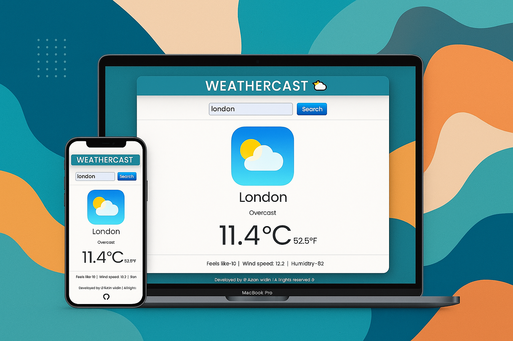

🌤️# Weathercast

A simple and modern weather forecasting web app built with HTML, CSS, and JavaScript, powered by WeatherAPI.

📌# Overview

WeatherCast provides real-time weather information for any city worldwide. With a clean UI and fast search functionality, users can instantly access important weather details such as:

🌡️ Temperature (°C & °F)

🤔 Feels Like

🌥️ Weather Condition

💨 Wind Speed

💧 Humidity

📍 City Name & Location Info

The app is lightweight, responsive, and easy to use—perfect for anyone who needs quick weather updates.

🎯 Features

🔍 City-based Weather Search

⚡ Real-time Weather Data fetched via WeatherAPI

🔄 Loading Spinner for smooth UI interaction

🎨 Simple & Clean Design

📊 Displays temperature, humidity, wind, and more

🛡️ Handles invalid cities with proper error messages

#🛠️ Tech Stack

-HTML5

-CSS3

-JavaScript (ES6)

-Bootstrap

-Netlify

WeatherAPI.com for live data
